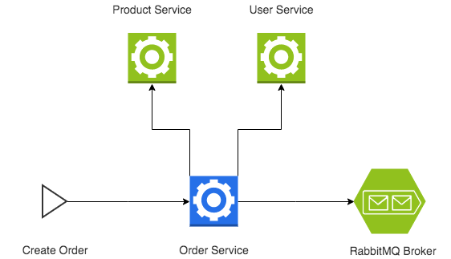

<p align="center">
  
</p>

## Prerequisites

- [docker](https://www.docker.com/)
- [docker-compose](https://docs.docker.com/compose/)


## Use Cases
Both [Product Service](docs/product-service.md) and [User Service](docs/user-service.md) have some faulty behavior for specific products and users. When testing the use cases below, be aware of them.

#### Create Order #1
```json
{
    "user_id": "7c11e1ce2741",
    "product_code": "classic-box"
}
```

#### Create Order #2
```json
{
    "user_id": "7c11e1ce2741",
    "product_code": "family-box"
}
```

#### Create Order #3
```json
{
    "user_id": "7c11e1ce2741",
    "product_code": "veggie-box"
}
```

#### Create Order #4
```json
{
    "user_id": "e6f24d7d1c7e",
    "product_code": "classic-box"
}
```

#### Create Order #5
```json
{
    "user_id": "e6f24d7d1c7e",
    "product_code": "family-box"
}
```

#### Create Order #6
```json
{
    "user_id": "e6f24d7d1c7e",
    "product_code": "veggie-box"
}
```
